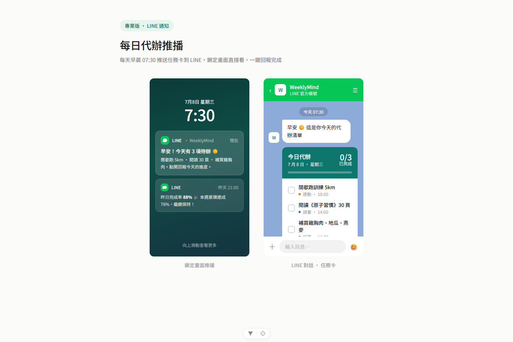
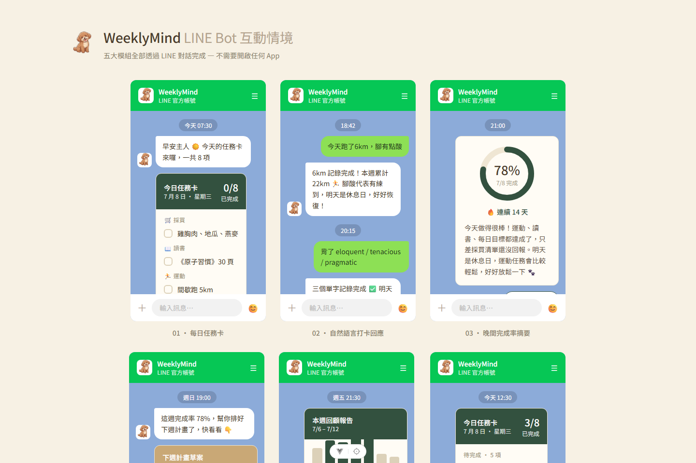

# WeeklyMind 網站操作手冊（圖文版）

這份文件用**實際畫面截圖**帶你走過整個網站——每一頁長怎樣、有哪些按鈕、點了會發生什麼事。技術細節（API、資料表、解鎖邏輯）不重複寫在這裡，各節都有連結指回 [api-architecture.md](../api-architecture.md) 與 [專案功能操作手冊.md](../專案功能操作手冊.md)。

> 📸 截圖來源：本機開發版（`npm run dev:full`），使用種子資料（[server/prisma/seed.ts](../server/prisma/seed.ts)）產生的示範帳號，畫面比例 1440×960。畫面文字、顏色以實際跑起來的網站為準；若你手上的版本改過樣式，畫面可能會跟截圖有落差，這是正常的（見 [README.md](../README.md) 更新這份手冊的方式）。

---

## 目錄

1. [登入前：訪客模式與登入畫面](#1-登入前訪客模式與登入畫面)
2. [登入後的共同介面（側邊欄導覽）](#2-登入後的共同介面側邊欄導覽)
3. [計畫中心（首頁）](#3-計畫中心首頁)
4. [執行中心](#4-執行中心)
5. [多益英文](#5-多益英文)
6. [作品集看板](#6-作品集看板)
7. [運動](#7-運動)
8. [連結收藏](#8-連結收藏)
9. [覆盤中心](#9-覆盤中心)
10. [設定](#10-設定)
11. [LineBot 設定](#11-linebot-設定)
12. [LINE 端的操作體驗](#12-line-端的操作體驗)

---

## 1. 登入前：訪客模式與登入畫面

### 1.1 登入頁

網站只有**一種正式登入入口**：「使用 LINE 帳號登入」。畫面上另外還有：

- **LINE / Telegram 分頁切換**：目前 Telegram 尚未真正接通，點下去只是切換畫面文字，實際登入只能走 LINE
- **「以新人身分體驗（沒有任何資料）」**：不需要任何帳號，直接建立一個全新的空白帳號並登入，適合想先看「完全沒有資料時畫面長怎樣」的人
- 手機號碼＋簡訊驗證碼登入已經**從畫面上移除**（後端 API 還在，純備用，不影響現在的行為），細節見 [LOGIN_操作手冊.md](../LOGIN_操作手冊.md)

### 1.2 訪客模式（不登入也能逛）

`/app/*` 底下的所有頁面**不需要登入就能進去看**，畫面右上角會多一個「訪客模式，點此登入」按鈕：

訪客模式的行為：

- 所有畫面都可以看，但因為沒有登入，後端不會回傳任何資料，所以看起來像是「全新空帳號」
- 一旦點擊新增／刪除／編輯等任何寫入操作，會跳出「請先登入」的提示，不會真的送出請求
- 想恢復成有資料的畫面，回到登入頁用 LINE 帳號登入即可

---

## 2. 登入後的共同介面（側邊欄導覽）

登入之後，左側固定顯示側邊欄選單，由上到下分三組：

| 分組 | 選單項目 |
| --- | --- |
| 目標計畫 | 多益英文、作品集看板、運動（＋使用者自訂新增的計畫） |
| 工具 | 連結收藏、覆盤中心 |
| 系統 | 設定、LineBot 設定 |

側邊欄最上方是「計畫管理」（也就是首頁／計畫中心）與「執行中心」，左下角常駐顯示「連續打卡天數」，底部有「說明」與「登出」。點「收合選單」可以把側邊欄縮成純圖示，省畫面空間。

右上角固定有通知鈴鐺與大頭貼（點大頭貼可以快速跳到設定頁的頭像選擇）。

---

## 3. 計畫中心（首頁）

登入後預設進入的頁面（路由 `/app/overview`），一次看完所有計畫的整體狀況：

- **頂部大目標宣言卡**：顯示使用者設定的長期目標（例：「我要去海外工作」），可點「編輯」修改；右邊圓環顯示目前追蹤中的計畫數量
- **週目標 / 月目標卡**：計畫的平均進度百分比，各自有「更多 →」可展開明細
- **月曆**：右上角有「同步」按鈕，日期下方列出「最新行程提醒」，每筆都可以打勾完成或刪除
- **里程碑**：打卡完成的目標會自動出現在這裡（唯讀、自動排序），沒有資料時顯示「＋」引導新增
- **進行中的計畫**：最多顯示 3 筆＋「查看全部」，每張卡片顯示進度環、打卡次數，可直接刪除
- **當前專注任務**（畫面下方，需捲動）：橫跨所有計畫的近期任務清單

新增計畫的入口在左側選單「＋新增計畫」，會依你選擇的範本（目標型／看板型／Tab 型）建立對應樣式的新頁面（即後面會看到的「自訂模組」）。

---

## 4. 執行中心

路由 `/app/exec`，把「這一週要做什麼」跟「今天做了多少」放在同一頁：

- **訓練計畫週曆條**：一週七天的圖示列，當天用深色底標示；每個圖示代表當天有排程的計畫類別
- **任務清單（日）**：點選上方某一天，下方會顯示當天對應的任務（`selectedDayIndex` 驅動，換一天內容就換一次）
- **核心能力雷達圖**：依照計畫類別（運動／多益／作品集…）畫出能力分布
- **本週階段進度長條圖**：一到日七天的完成度
- **連續打卡天數卡**（右上角橘色大卡）：跟側邊欄左下角是同一份資料
- 右側直列每個進行中計畫的進度條＋「＋新增任務」按鈕，可以直接對單一計畫加任務
- 下方「分類每日進度」「今日時程表」：目前沒有分類/時段時顯示空狀態引導

---

## 5. 多益英文

路由 `/app/toeic`，這是「目標模板」的原型頁面（使用者自訂新增的目標型計畫會沿用同一套版型）：

- 左上角進度環：目前分數／目標分數
- **每日任務卡**：背單字、閱讀測驗、克漏字、英文課本、每日對話，各自獨立打卡，完成會顯示綠色勾選＋刪除線效果，卡片右上角可編輯／刪除任務
- 右側「考試天數」：倒數天數清單，可新增/刪除
- 右側「模考分數」：目前分數 vs 本次目標，可點筆狀圖示編輯
- 右下「英文連續打卡」：獨立於全站連續打卡天數的專屬計數
- 下方「分數趨勢」長條圖：歷次模考分數變化

---

## 6. 作品集看板

路由 `/app/portfolio`，這是「看板模板」的原型頁面：

- 固定三欄「待辦／進行中／已完成」，欄位標題旁的數字是該欄卡片數
- **卡片可拖曳**（`vue-draggable-plus`）在三欄之間切換狀態，也可以直接點卡片開啟編輯詳情
- 進行中的卡片會顯示每日完成百分比（例：「每日訂餐小工具．30% 完成」）
- 右上角「＋新增專案」建立新卡片，預設進「待辦」欄

---

## 7. 運動

路由 `/app/sport`，這是「Tab 模板」的原型頁面，使用者可以**自訂新增/刪除分類分頁**（例如：慢跑、重訓、瑜珈，每個分頁各自維護一份打卡清單）。截圖是示範帳號尚未建立任何分頁時的初始畫面——點「＋新增運動」或畫面中央的「＋」都可以建立第一個分類分頁。

透過 LINE 傳「跑了 5 公里」這類訊息，也會直接寫入運動打卡紀錄（不需要開網頁），細節見下方 [§12](#12-line-端的操作體驗)。

---

## 8. 連結收藏

路由 `/app/links`，貼上 Instagram／Threads／Facebook 連結，系統會**自動依網址判斷平台分類**並歸到對應欄位（畫面上方提示文字：「在 LINE 貼上連結，會自動依平台分類歸檔，這裡也可以手動新增」）。也可以直接在網頁上點「＋新增連結」手動加。

**這個功能預設是鎖定的**：新帳號要先在「計畫中心」新增第一個計畫，才會解鎖 `links_unlocked`，選單項目才會出現、頁面才能進入。

---

## 9. 覆盤中心

路由 `/app/retro`，回顧所有目標的長期進度：

- **各項目標進度表**：長條進度條＋「預計 N 天・目前第 X 天」文字，右側垃圾桶可刪除
- **本週達成率變化**：一到日的長條圖
- **各分類達成率佔比**：甜甜圈圖，中間顯示整體達成率百分比，右側圖例列出各分類百分比

**這個功能也是鎖定的**：累積打卡次數達到 5 次才會解鎖 `retro_unlocked`。

---

## 10. 設定

路由 `/app/settings`：

- **通訊軟體綁定**：LINE / Telegram 切換卡片，顯示目前綁定與使用中的平台
- **寵物頭像**：四選一的貴賓犬頭像，選了會同步顯示在側邊欄與里程碑卡片上
- **主題色彩**：海洋系列／星空系列／櫻花系列三種配色，**累積打卡達 15 次才解鎖**（`theme_unlocked`），未解鎖前卡片顯示鎖頭圖示
- **登入資訊**：顯示目前帳號的登入方式（手機號碼或 LINE），可點「修改」
- 下方（需捲動）還有「連結分類設定」等進階選項

---

## 11. LineBot 設定

路由 `/app/linebot`。**目前這個頁面本身還沒開放**——畫面顯示「LineBot 設定尚未解鎖／這個工具還在整理，之後開放時會通知你」的鎖定畫面，側邊欄圖示也是鎖頭。

規劃中的內容（綁定通訊軟體、Bot 回覆語言、推播排程設定、手機模擬預覽）見 [專案功能操作手冊.md](../專案功能操作手冊.md) §4.9 與 [api-architecture.md](../api-architecture.md)，等實際開放後這份手冊會補上真實截圖。

---

## 12. LINE 端的操作體驗

WeeklyMind 的核心互動其實發生在 LINE 對話裡，不是網頁——網頁後台是「回顧與管理」，LINE 是「每天實際打卡的地方」。下面兩張是站內的情境展示頁（`/line/notify`、`/line/bot`，純展示用途，不是真的連到 LINE 平台），用來說明真實 LINE 對話會長什麼樣子：

### 12.1 每日代辦推播

每天早上（預設 07:30，見 [DEPLOYMENT.md](../DEPLOYMENT.md) §4）系統會主動推送一張「今日代辦」Flex Message 卡片到 LINE，鎖定畫面也能看到通知預覽，點開對話可以直接勾選完成項目。

### 12.2 LINE Bot 對話互動情境

五大模組**全部可以透過純文字對話完成，不需要開任何 App**。目前實際支援判斷的關鍵字（見 [專案功能操作手冊.md](../專案功能操作手冊.md) §5.1）：

| 你在 LINE 輸入 | 系統會做的事 |
| --- | --- |
| 貼一個網址 | 自動存到「連結收藏」，並判斷平台分類 |
| 「跑了 5 公里」 | 寫入運動打卡紀錄 |
| 「背了 20 個單字」 | 寫入多益打卡進度 |
| 「學了 Vue」／「看了 React」 | 寫入每日任務打卡 |
| 「任務」 | 機器人回傳今天的任務卡（跟每日推播同一張卡） |
| 其他文字 | 不在上面清單內的內容，會收到隨機的 fallback 回覆 |

每週五 21:00 另外會推送一次「本週回顧報告」，統計本週完成率並列出下週計畫草案。

---

## 附：這份手冊怎麼更新

畫面改版後，重新產生截圖的步驟：

1. `docker compose up -d` 啟動本機資料庫（**不要**動 `server/.env`，那個檔案目前指向正式站 Supabase；本機測試用環境變數覆蓋即可，不要污染正式站資料）
2. 對本機資料庫跑 `npx prisma migrate deploy` + `npx tsx prisma/seed.ts`，取得示範帳號的 `userId`
3. 用 `jsonwebtoken` 對該 `userId` 簽一組本機測試用 JWT（`{ userId }`，跟後端啟動時同一組 `JWT_SECRET`）
4. 啟動前後端（`npm run dev:full` 或分開啟動），用 Playwright 開瀏覽器、把 JWT 寫進 `localStorage.weeklymind_token`，逐頁 `page.goto()` + `page.screenshot()`
5. 截圖存到 `docs/screenshots/`，完成後記得停掉本機服務、把本機資料庫容器停掉（`docker compose down`）

這個流程不需要真的申請 LINE Login、也不會動到正式站資料庫，示範資料完全來自 `server/prisma/seed.ts`。
