# WeeklyMind 網站操作手冊

**文件索引**：

- **API 架構與技術說明**：[api-architecture.md](api-architecture.md)
- **完整功能與操作說明**：[專案功能操作手冊.md](專案功能操作手冊.md)
- **專案介紹與文件更新方式**：[README.md](../README.md)
- **截圖資訊**：附上各功能頁面之完整畫面截圖

> 📸 **截圖說明**
>
> - **截圖環境**：本機開發版（`npm run dev:full`）
> - **示範資料**：由種子資料（[server/prisma/seed.ts](../server/prisma/seed.ts)）產生的示範帳號
> - **畫面比例**：1440 × 960
> - **顯示差異**：文字與顏色以實際運行的網站為準；若版本修改過樣式導致畫面與截圖不同屬正常情況（更新手冊方式請參閱附錄）

---

## 目錄

1. [登入前：訪客模式與登入畫面](#1-登入前訪客模式與登入畫面)
2. [登入後的共同介面（側邊欄導覽）](#2-登入後的共同介面側邊欄導覽)
3. [計劃管理](#3-計劃管理)
4. [執行中心](#4-執行中心)
5. [三種計畫模板總覽](#5-三種計畫模板總覽)
6. [目標型範本（多益英文）](#6-目標型範本多益英文)
7. [看板型範本（作品集看板）](#7-看板型範本作品集看板)
8. [Tab 型範本（運動）](#8-tab-型範本運動)
9. [連結收藏](#9-連結收藏)
10. [覆盤中心](#10-覆盤中心)
11. [設定](#11-設定)
12. [LineBot 設定](#12-linebot-設定)
13. [附錄：手冊與截圖更新流程](#附錄手冊與截圖更新流程)

---

## 1. 登入前：訪客模式與登入畫面

### 1.1 登入頁

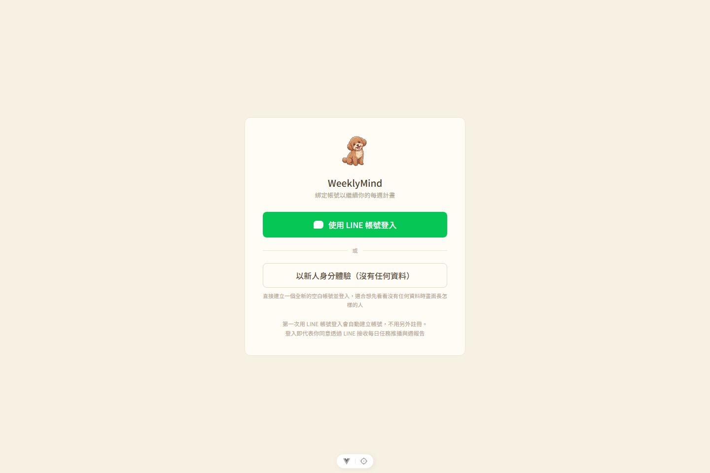

- **主要登入入口**：僅提供「使用 LINE 帳號登入」
- **新人體驗模式**：提供「以新人身分體驗（沒有任何資料）」選項，無需註冊即可建立全新空白帳號登入試用

### 1.2 訪客模式（免登入瀏覽）

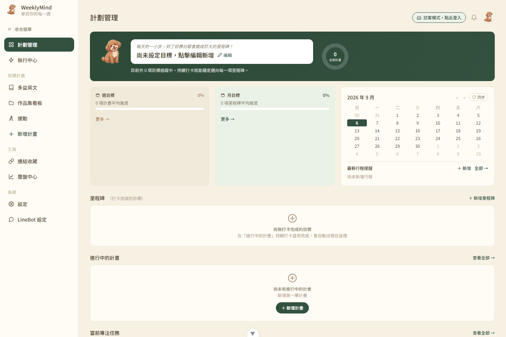

- **介面標示**：畫面右上角會顯示「訪客模式，點此登入」按鈕
- **資料顯示機制**：未登入狀態下後端不回傳任何資料，畫面呈現全新空白帳號樣貌
- **寫入權限限制**：點擊新增、刪除、編輯等寫入操作時，系統會阻擋請求並彈出「請先登入」提示
- **還原個人資料**：返回登入頁並使用 LINE 帳號登入，即可載入個人既有資料

---

## 2. 登入後的共同介面（側邊欄導覽）

登入後左側固定顯示側邊欄選單，分為三大區塊：

| 分組 | 選單項目 |
| --- | --- |
| 目標計畫 | 多益英文、作品集看板、運動（以及使用者自訂新增的計畫） |
| 工具 | 連結收藏、覆盤中心 |
| 系統 | 設定、LineBot 設定 |

側邊欄其他功能與全域配置：

- **頂部入口**：「計劃管理」（首頁）與「執行中心」
- **打卡資訊**：左下角常駐顯示「連續打卡天數」
- **底部功能**：提供「說明」文件入口與「登出」按鈕
- **收合切換**：點擊「收合選單」可將側邊欄縮小為純圖示模式，釋放主畫面空間
- **頂部導覽列**：右上角常駐通知鈴鐺與大頭貼（點擊大頭貼可快速導流至設定頁挑選頭像）

---

## 3. 計劃管理

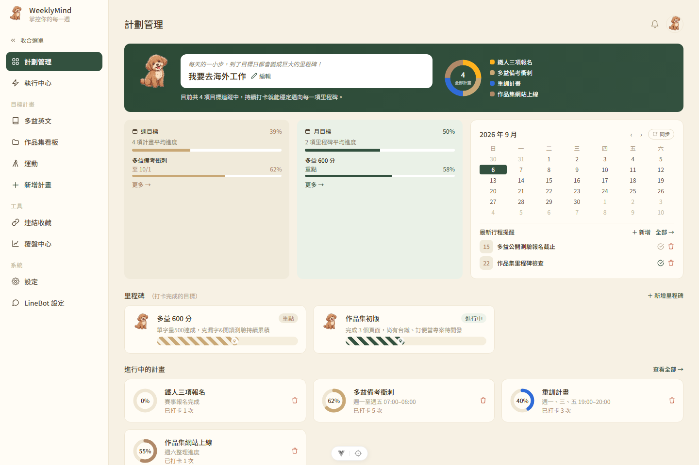

登入後預設導向頁面（路由 `/app/overview`），綜覽所有計畫的進度狀態：

- **頂部大目標宣言卡**：顯示長期目標設定（例如：「我要去海外工作」），支援點擊「編輯」即時修改；右側圓環顯示目前追蹤中的計畫總數
- **週目標 / 月目標卡**：顯示計畫平均進度百分比，點擊「更多 →」可展開細項
- **整合月曆**：右上角配置「同步」按鈕，日期下方顯示「最新行程提醒」，支援勾選完成或直接刪除
- **里程碑專區**：打卡完成的目標將自動歸檔排序於此（唯讀模式）；無資料時顯示「＋」引導建立
- **進行中的計畫**：預設顯示最多 3 筆，並提供「查看全部」入口；卡片標示進度環與打卡次數，支援直接刪除
- **當前專注任務**：位於頁面下方（需滾動），彙整所有計畫近期的任務清單
- **新增計畫**：透過側邊欄「＋新增計畫」，可選用「目標型」、「看板型」或「Tab 型」範本建立自訂模組頁面

---

## 4. 執行中心

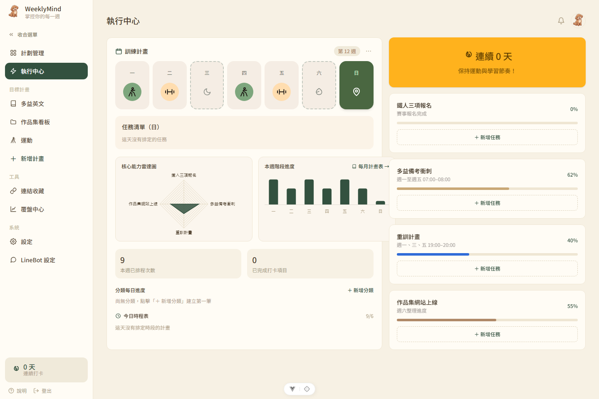

整合每週排程與當日執行狀況（路由 `/app/exec`）：

- **訓練計畫週曆條**：橫向展示週一至週日圖示，當天以深色背景醒目標記；圖示標記當日具備排程的計畫類別
- **每日任務清單**：點擊上方日期切換（由 `selectedDayIndex` 驅動），同步更新下方對應任務
- **核心能力雷達圖**：依據計畫類別（運動、多益、作品集等）動態繪製能力分布
- **本週階段進度長條圖**：視覺化呈現一週七天的完成率分佈
- **連續打卡天數卡**：右上角橘色狀態卡（資料與側邊欄連動）
- **計畫任務快加**：右側列表顯示各計畫進度條，點擊「＋新增任務」可快速建立任務
- **進度與排程區塊**：底部提供「分類每日進度」與「今日時程表」；未設定時呈現空白引導提示

---

## 5. 三種計畫模板總覽

「計劃管理」點擊「＋新增計畫」時，可選用以下三種範本建立自訂模組頁面（見 [第 3 節](#3-計劃管理)）；多益英文、作品集看板、運動三頁分別是三種範本各自的代表頁面：

| 模板 | 代表頁面 | 核心互動 | 適合情境 |
| --- | --- | --- | --- |
| **目標型範本** | 多益英文（[第 6 節](#6-目標型範本多益英文)） | 進度環＋每日任務清單，逐項打卡並追蹤分數／天數 | 有明確終點指標的目標，例如證照分數、考試倒數 |
| **看板型範本** | 作品集看板（[第 7 節](#7-看板型範本作品集看板)） | 「待辦／進行中／已完成」三欄拖曳看板 | 多個獨立專案並行管理，需要一眼看到整體流轉狀態 |
| **Tab 型範本** | 運動（[第 8 節](#8-tab-型範本運動)） | 自訂分類分頁，各分頁獨立維護打卡清單 | 同一大類下有多個子項目，各自打卡頻率或內容不同（例如慢跑／重訓／瑜珈） |

---

## 6. 目標型範本（多益英文）

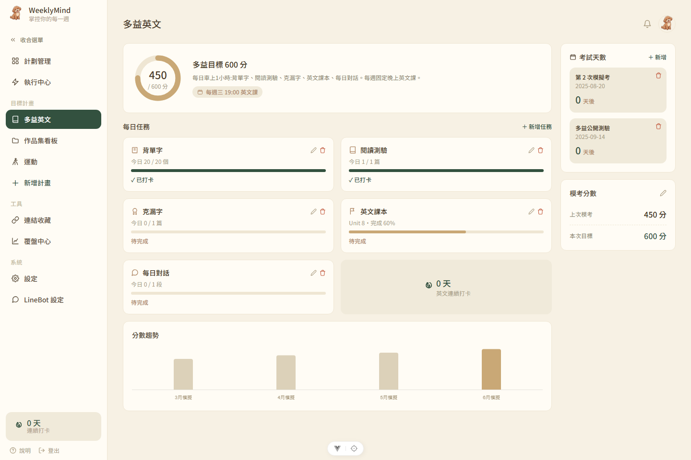

「目標模板」原型頁面（路由 `/app/toeic`，後續自訂之目標型計畫皆沿用此架構）：

- **目標進度環**：左上角即時呈現當前分數與目標分數比例
- **每日任務卡**：預設包含背單字、閱讀測驗、克漏字、英文課本、每日對話等項目，支援獨立打卡，完成後標記綠色勾選並套用刪除線樣式，卡片右上角支援編輯與刪除
- **考試倒數天數**：右側列出考試倒數清單，支援新增與刪除
- **模考分數追蹤／設定目標**：顯示目前模考成績與目標對比，點擊筆狀圖示開啟「編輯模考分數」視窗，可同時修改「上次模考分數」與「本次目標分數」——左上角目標進度環即依此設定的目標分數即時換算比例
- **專屬打卡計數**：右下方「英文連續打卡」記錄專屬天數，獨立於全站累計打卡數
- **分數趨勢圖表**：下方長條圖呈現歷次模擬考成績變化曲線

---

## 7. 看板型範本（作品集看板）

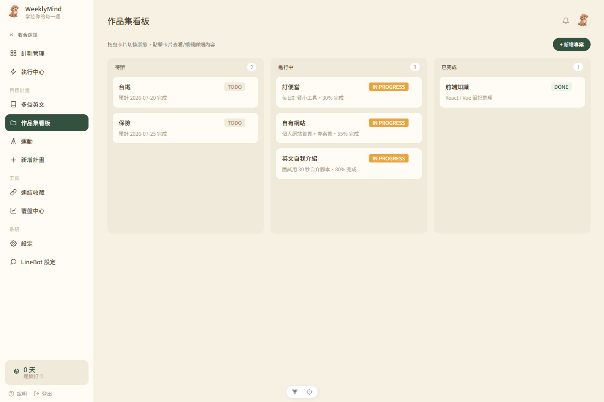

「看板模板」原型頁面（路由 `/app/portfolio`）：

- **三欄式看板**：固定規劃「待辦」、「進行中」、「已完成」三欄，標題旁數字顯示該欄卡片數量
- **拖曳卡片互動**：卡片支援拖曳跨欄操作（採用 `vue-draggable-plus`），點擊卡片可開啟詳細編輯視窗
- **進行中卡片進度**：卡片可標註每日完成度（例如：「每日訂餐小工具．30% 完成」）
- **新增卡片**：右上角點擊「＋新增專案」，預設將新項目建立於「待辦」欄位

---

## 8. Tab 型範本（運動）

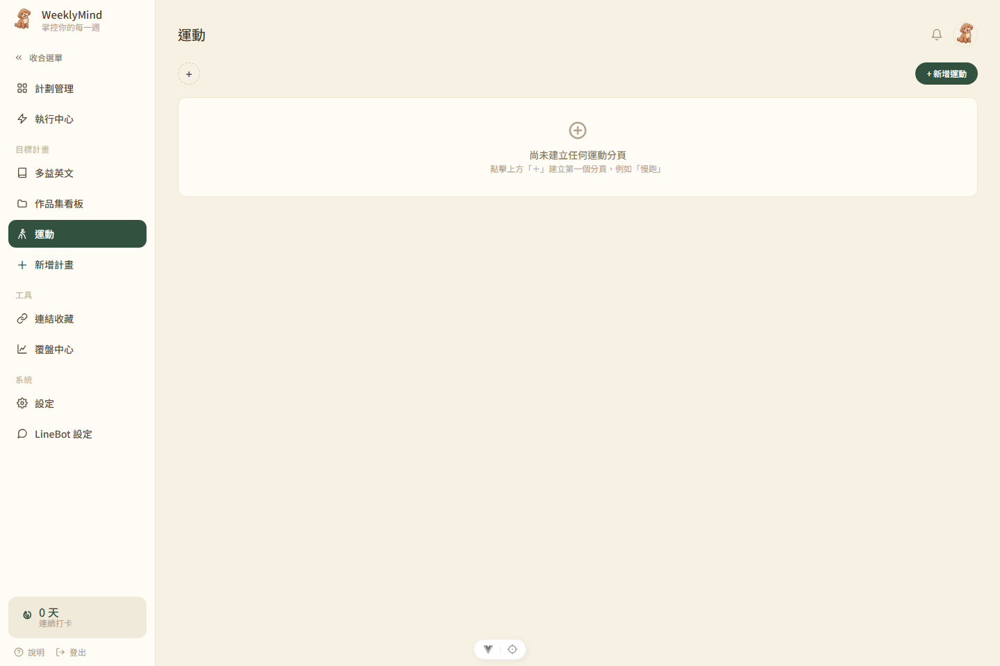

「Tab 模板」原型頁面（路由 `/app/sport`）：

- **自訂分類分頁**：支援新增與刪除自訂分頁（如慢跑、重訓、瑜珈），各分頁獨立維護打卡清單
- **初始狀態引導**：尚未建立分頁時顯示初始畫面，點擊「＋新增運動」或中央「＋」即可建立首個分類
- **LINE 訊息快速打卡**：於 LINE 發送文字（如「跑了 5 公里」）即可自動寫入打卡紀錄，無需開啟網頁，詳見 [專案功能操作手冊.md](專案功能操作手冊.md) §5.1

---

## 9. 連結收藏

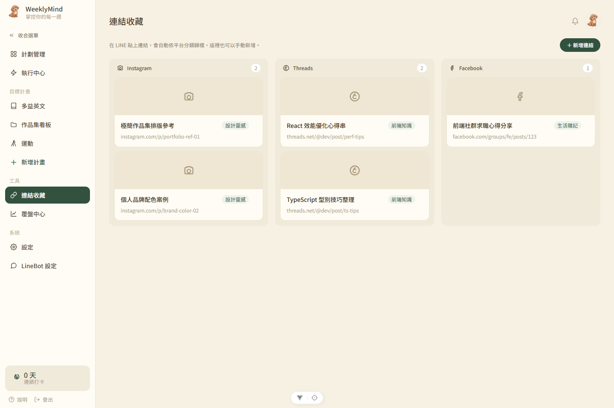

路由 `/app/links`，用於管理社群平台與各類網頁連結（此功能預設鎖定，尚未解鎖）：

- **鎖定解鎖條件**：初始帳號預設為鎖定狀態，需於「計劃管理」成功新增第一個計畫，系統才會發放 `links_unlocked` 權限；解鎖後側邊欄才會顯現選單入口，使用者方可進入此頁面
- **自動分類歸檔**：支援貼上 Instagram、Threads、Facebook 連結，後端自動解析網址並分類至對應欄位
- **LINE 整合同步**：可直接於 LINE 聊天室傳送連結進行自動分類歸檔
- **手動新增**：頁面提供「＋新增連結」按鈕支援手動建立連結項目

---

## 10. 覆盤中心

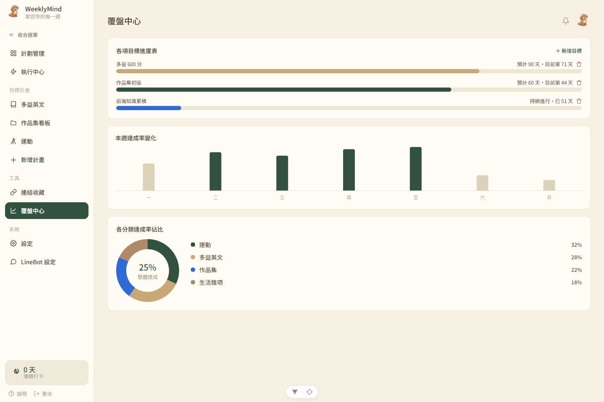

路由 `/app/retro`，檢視各項計畫的長期成效：

- **功能鎖定條件**：全站累積打卡次數達 5 次方可解鎖該功能（`retro_unlocked`）
- **各項目標進度表**：以長條圖顯示進度，搭配「預計 N 天・目前第 X 天」標記，支援直接點擊垃圾桶刪除
- **本週達成率變化**：長條圖視覺化呈現週一至週日各日達成率
- **各分類達成率佔比**：甜甜圈圖顯示整體平均達成率，右側圖例列出各分類項目佔比

---

## 11. 設定

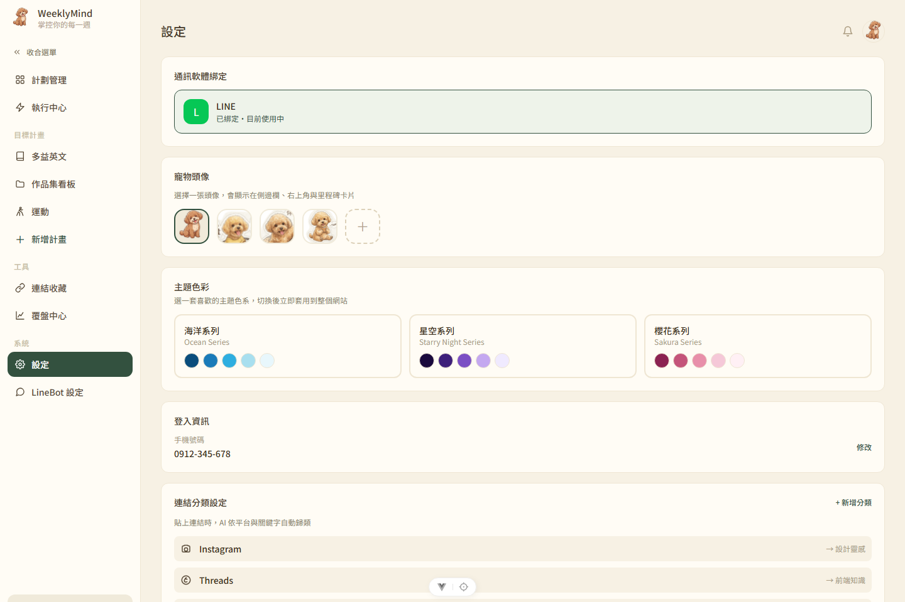

系統偏好與帳號管理頁面（路由 `/app/settings`）：

- **通訊軟體綁定**：檢視目前綁定並連動中的 LINE 帳號資訊
- **寵物頭像挑選**：提供四款貴賓犬頭像切換，設定後同步更新至側邊欄與里程碑卡片
- **主題色彩切換**：提供海洋系列、星空系列、櫻花系列三種色彩主題，任選一套即可立即套用到整個網站
- **連結分類設定**：頁面下方顯示連結收藏的自動分類對照（IG／Threads／FB → 分類），唯讀參考，實際分類邏輯在後端（需向下捲動）

---

## 12. LineBot 設定

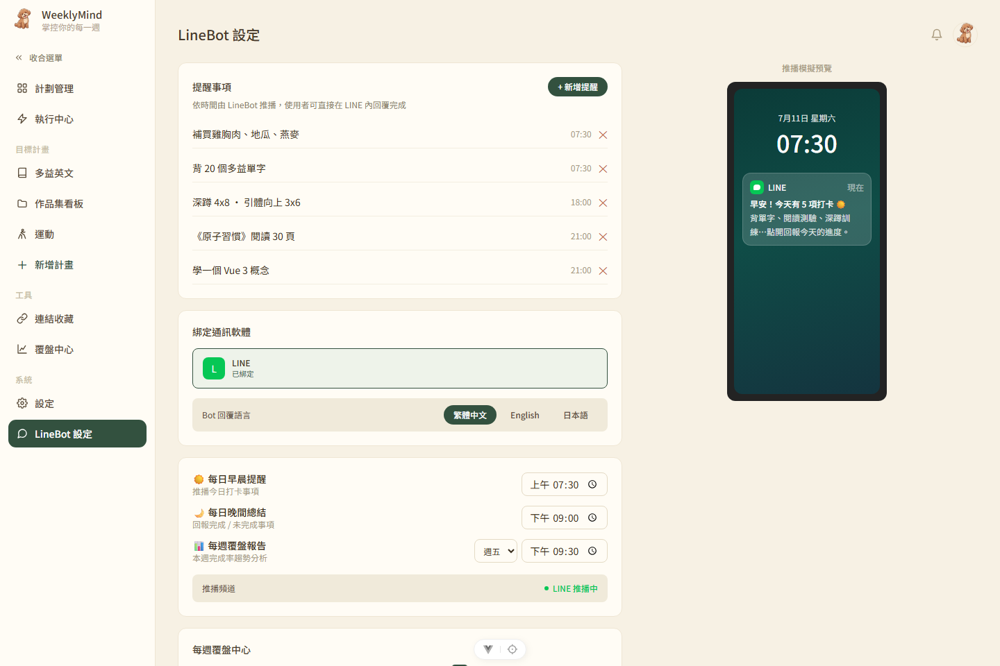

路由 `/app/linebot`：

- **提醒事項**：依時間由 LineBot 推播，使用者可直接在 LINE 內回覆完成
- **綁定通訊軟體**：顯示目前綁定的 LINE 帳號狀態
- **Bot 回覆語言**：可切換繁體中文／English／日本語
- **推播時間設定**：可調整每日早晨提醒、每日晚間總結、每週覆盤報告的時間與星期
- **推播模擬預覽**：右側手機畫面即時模擬 LINE 推播卡片樣式
- **技術參考**：架構細節請參閱 [專案功能操作手冊.md](專案功能操作手冊.md) §4.9 與 [api-architecture.md](api-architecture.md)

---
